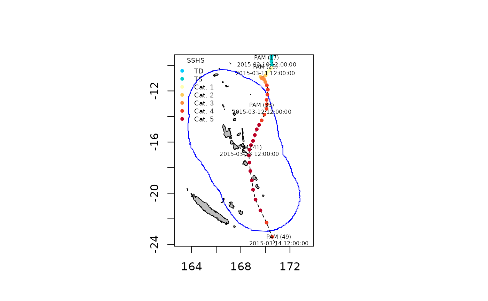
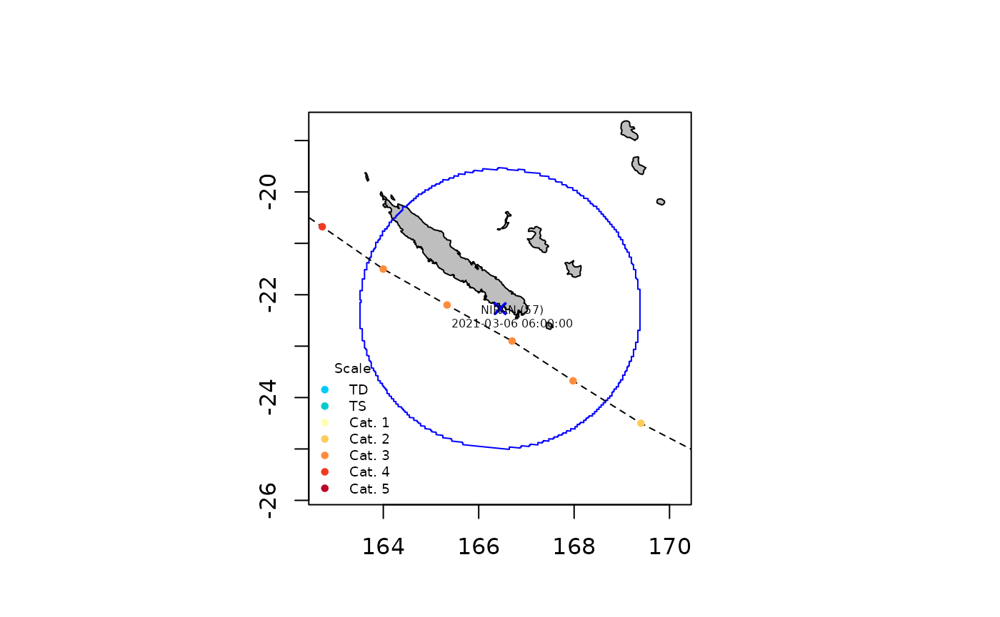
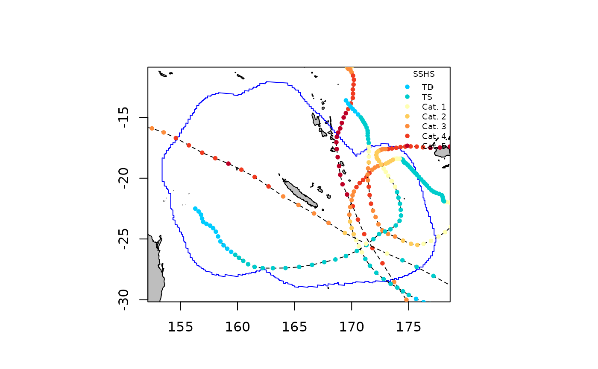

# Extract Storms

The [`defStormsList()`](../reference/defStormsList.md) function allows
to extract tropical cyclone track data for a given tropical cyclone or
set of tropical cyclones nearby a given location of interest (`loi`).
The `loi` can be defined using a country name, a specific point (defined
by its longitude and latitude coordinates), or any user imported or
defined spatial polygon shapefiles. By default only observations located
within 300 km around the `loi` are extracted but this can be changed
using the `max_dist` argument. Users can also extract tropical cyclones
using the `name` of the storm or the `season` during which it occurred.
If both the `name` and the `season` arguments are not filled then the
[`defStormsList()`](../reference/defStormsList.md) function extracts all
tropical cyclones since the first cyclonic season in the database. Once
the data are extracted, the [`plotStorms()`](../reference/plotStorms.md)
function can be used to visualize the trajectories and points of
observation of extracted tropical cyclones on a map.

In the following example we use the `test_dataset` provided with the
package to illustrate how cyclone track data can be extracted and
visualised using country and cyclone names, specific point locations,
and polygon shapefiles, as described below.

### Getting and ploting tropical cyclone track data

#### Using country names

We extract data on the tropical cyclone Pam (2015) nearby Vanuatu as
follows:

``` r
sds <- defStormsDataset(verbose = 0)
```

    ## Warning: No basin argument specified. StormR will work as expected
    ##              but cannot use basin filtering for speed-up when collecting data

``` r
st <- defStormsList(sds = sds, loi = "Vanuatu", names = "PAM", verbose = 0)
```

The [`defStormsList()`](../reference/defStormsList.md) function returns
a `stormsList` object in which the first slot `@data` contains a list of
`Storm` objects. With the above specification the `stormsList` contains
only one `Storm` object corresponding to cyclone PAM and the track data
can be obtained using the [`getObs()`](../reference/getObs-methods.md)
function as follows:

``` r
head(getObs(st, name = "PAM"))
```

    ##              iso.time      lon       lat msw scale rmw   pres   poci
    ## 1 2015-03-08 12:00:00 168.9000 -7.500000  13     0  93 100400 100500
    ## 2 2015-03-08 15:00:00 169.0425 -7.652509  14     0  93 100200 100200
    ## 3 2015-03-08 18:00:00 169.2000 -7.800000  15     0  93 100000 100000
    ## 4 2015-03-08 21:00:00 169.3850 -7.942489  15     0  93 100000 100000
    ## 5 2015-03-09 00:00:00 169.6000 -8.100000  15     0  93 100000 100100
    ## 6 2015-03-09 03:00:00 169.8425 -8.284999  16     0  93  99800 100100

The number of observation and the indices of the observations can be
obtained using the [`getNbObs()`](../reference/getNbObs-methods.md) and
[`getInObs()`](../reference/getInObs-methods.md) as follows:

``` r
getNbObs(st, name = "PAM")
```

    ## [1] 57

``` r
getInObs(st, name = "PAM")
```

    ##  [1] 28 29 30 31 32 33 34 35 36 37 38 39 40 41 42 43 44 45 46 47

The data can be visualised on a map as follows:

``` r
plotStorms(st, labels = TRUE)
```



#### Using a specified point location

We can extract all tropical cyclones near Nouméa (longitude = 166.45,
latitude = -22.27) between 2015 and 2021 as follows:

``` r
pt <- c(166.45, -22.27)
st <- defStormsList(sds = sds, loi = pt, seasons = c(2015, 2021), verbose = 0)
```

The number, the names, and the season of occurrence of the storms in the
returned `stormsList` object can be obtained using the
[`getNbStorms()`](../reference/getNbStorms-methods.md),
[`getNames()`](../reference/getNames-methods.md), and
[`getSeasons()`](../reference/getSeasons-methods.md) functions as
follows:

``` r
getNbStorms(st)
```

    ## [1] 4

``` r
getNames(st)
```

    ## [1] "SOLO"   "GRETEL" "LUCAS"  "NIRAN"

``` r
getSeasons(st)
```

    ##   SOLO GRETEL  LUCAS  NIRAN 
    ##   2015   2020   2021   2021

We can plot track data for the topical cyclone Niran only using the
`names` argument of the [`plotStorms()`](../reference/plotStorms.md)
function as follows:

``` r
plotStorms(st, names = "NIRAN", labels = TRUE, legends = "bottomleft")
```



The track data for Niran can also be extracted and stored in a new
object using the [`getStorm()`](../reference/getStorm-methods.md)
function as follows:

``` r
NIRAN <- getStorm(st, name = "NIRAN")
getNames(NIRAN)
```

    ## [1] "NIRAN"

#### Using a user defined spatial polygon shapefile

We can extract all tropical cyclones that occurred between 2015 and 2021
near the New Caledonia exclusive economic zone using the `eezNC`
shapefile provided with the `StormR` package as follows:

``` r
sp <- eezNC
st <- defStormsList(sds = sds, loi = eezNC, season = c(2015, 2021), verbose = 0)
```

Information about the spatial extent of the track data exaction can be
obtained using the [`getLOI()`](../reference/getLOI-methods.md),
[`getBuffer()`](../reference/getBuffer-methods.md), and
[`getBufferSize()`](../reference/getBufferSize-methods.md) functions as
follows:

``` r
LOI <- getLOI(st)
Buffer <- getBuffer(st)
BufferSize <- getBufferSize(st)
terra::plot(Buffer, lty = 3, main = paste(BufferSize, "km buffer arround New Caledonian EEZ", sep = " "))
terra::plot(LOI, add = TRUE)
terra::plot(countriesHigh, add = TRUE)
```


### Working with multiple storms

When extracting multiple storms for a long period of time, you can find
yourself with multiple storms sharing the same name, that can later
break `StormR`. You need to avoid working with duplicated name
(especially relevant when both storms in a stormsList have the same name
on the same season). Some workarounds may help you with that:

- use the “removeUnnamed” argument to `defStormsList`
- use the `renameStorms` function:

``` r
getNames(st)
```

    ## [1] "PAM"     "SOLO"    "ULA"     "WINSTON" "ZENA"    "UESI"    "GRETEL" 
    ## [8] "LUCAS"   "NIRAN"

``` r
st_renamed <- renameStorms(st)
getNames(st_renamed)
```

    ## [1] "PAM-2015"     "SOLO-2015"    "ULA-2016"     "WINSTON-2016" "ZENA-2016"   
    ## [6] "UESI-2020"    "GRETEL-2020"  "LUCAS-2021"   "NIRAN-2021"

### Using different wind scale

By default the Saffir-Simpson hurricane wind scale (SSHS) is used in
[`defStormsList()`](../reference/defStormsList.md) to assign level to
storms.

The maximum level reached in the scale for each cyclone can then be
obtained using the [`getScale()`](../reference/getScale-methods.md)
function as follows:

``` r
getScale(st)
```

    ##     PAM    SOLO     ULA WINSTON    ZENA    UESI  GRETEL   LUCAS   NIRAN 
    ##       6       1       5       6       3       2       2       2       6

In this case, the SSHS scale is composed of 6 thresholds resulting in 6
levels spanning from level 0 to level 6.

We can only plot cyclones that reached level 5 and 6 using the
`category` argument of the [`plotStorms()`](../reference/plotStorms.md)
function as follows:

``` r
plotStorms(st, category = c(5, 6), labels = FALSE, legends = "topright")
```

 Finally, the user can
choose his own scale and associated palette, by setting the `scale` and
`scalePalette` inputs in
[`defStormsList()`](../reference/defStormsList.md). In the following
example, we use the Tokyo’s tropical cyclone intensity scale to analyse
tropical storm PAM.

StormR provides default palette and category names:

``` r
# Tokyo's tropical cyclone intensity scale
RSMCScale <- c(16.94, 24.44, 32.5, 43.33, 53.61)

sts_jpn <- defStormsList(sds = sds,
                         loi = "Vanuatu",
                         names = "PAM",
                         scale = RSMCScale,
                         verbose = 0)

plotStorms(sts_jpn)
```


But you can also easily customize them:

``` r
RSMCPalette <- c("#6ec1ea", "#4dffff", "#c0ffc0", "#ffd98c", "#ff738a", "#a188fc")
names(RSMCPalette) <- c("Tropical depression",
                        "Tropical storm",
                        "Severe tropical storm",
                        "Typhoon",
                        "Very strong typhoon",
                        "Violent typhoon")

sts_jpn <- defStormsList(sds = sds,
                         loi = "Vanuatu",
                         names = "PAM",
                         scale = RSMCScale,
                         scalePalette = RSMCPalette,
                         verbose = 0)

plotStorms(sts_jpn)
```


### Dynamic plot

`plotStorms` allows the user to dynamically plot tracks within an
interactive map using leaflet library by setting `dynamicPlot` to
`TRUE`. Doing so, the user can explore the map the way he wants and
click and each dotted colored observations to see there informations.

``` r
# Example of dynamic plot, using the same parameters above
plotStorms(st, category = c(4, 5), labels = FALSE, legends = "topright", dynamicPlot=TRUE)
```
