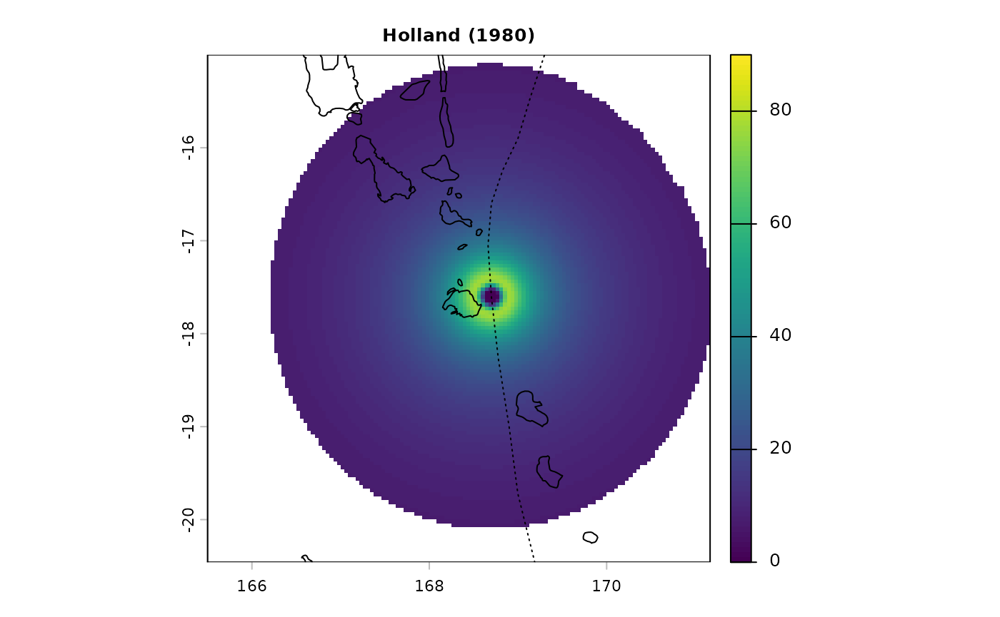
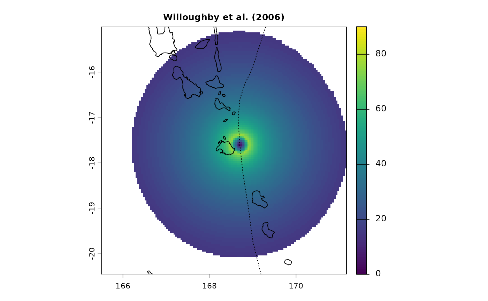
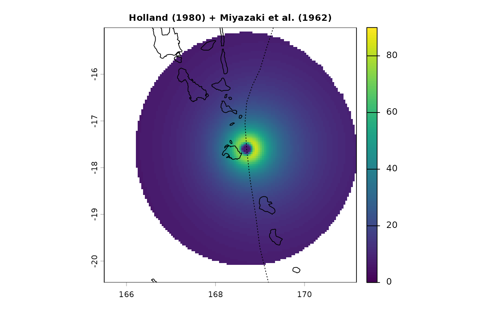
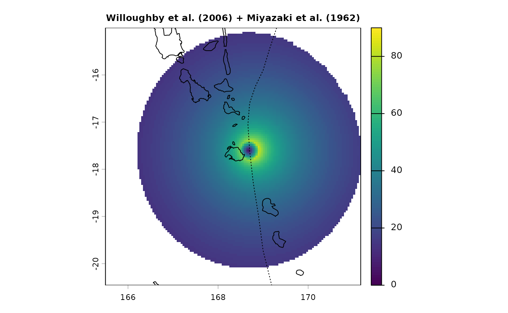
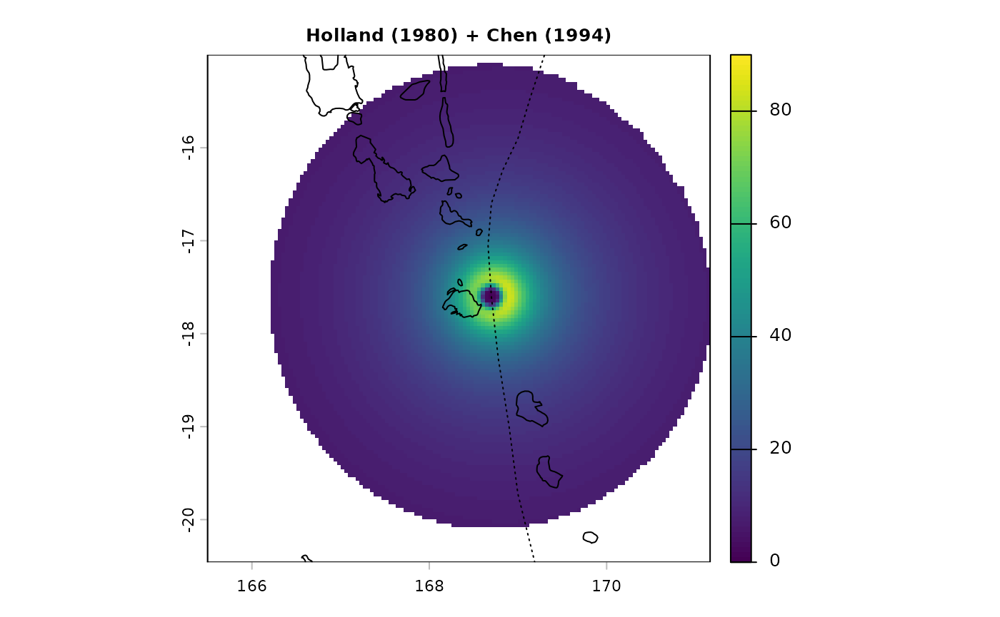
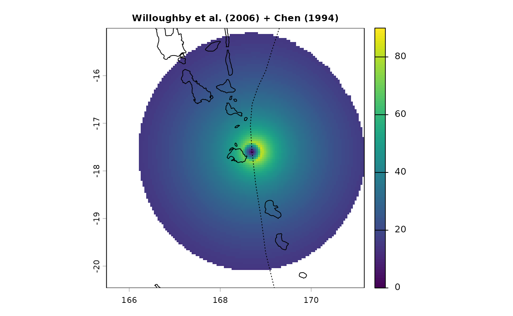
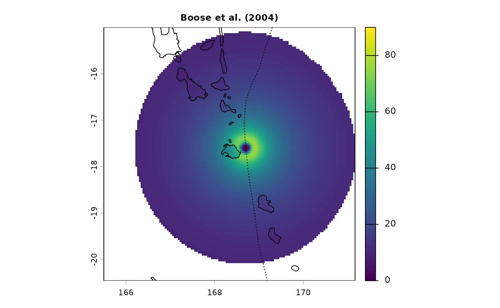

# Models

The main functions of the `StormR` package,
[`spatialBehaviour()`](../reference/spatialBehaviour.md) and
[`temporalBehaviour()`](../reference/temporalBehaviour.md), allow to
compute characteristics of the storm surface wind field, as
re-constructed from storm track data and a parametric cyclone model.
Three parametric models are implemented in this package: Holland (1980),
Willoughby *et al.* (2006), and Boose *et al.* (2004). The use of one
model or the other is defined using the `method` argument in
[`spatialBehaviour()`](../reference/spatialBehaviour.md) and
[`temporalBehaviour()`](../reference/temporalBehaviour.md) functions.

The original Holland (1980) and Willoughby *et al.* (2006) models
provide a symmetrical wind field around the cyclone centre. However,
cyclonic winds are not symmetric, and an order zero asymmetry is caused
by the storm translation (forward motion). We therefore suggest using an
asymmetric version of the parametric wind fields that takes into account
storm motion. In the `StormR` package the methods developed by Miyazaki
*et al.* (1962) and Chen (1994) that allow to take this asymmetry into
account can be used to adjust the outputs of the symmetrical models
accordingly. These can be activated by using the `asymmetry` argument of
the [`spatialBehaviour()`](../reference/spatialBehaviour.md) and
[`temporalBehaviour()`](../reference/temporalBehaviour.md) functions.
The model of Boose *et al.* (2004) is already an asymmetrical version of
the Holland (1980) model. Contrary to the Holland (1980) and Willoughby
*et al.* (2006), this model considers different parameter settings over
water or over lands.

By default the [`spatialBehaviour()`](../reference/spatialBehaviour.md)
and [`temporalBehaviour()`](../reference/temporalBehaviour.md) functions
use the Willoughby *et al.* (2006) model adjusted using the Chen (1994)
method.

### Holland (1980) symmetric wind field

The Holland model (1980), widely used in the literature, is based on the
gradient wind balance in mature tropical cyclones. The wind speed
distribution is computed from the circular air pressure field, which can
be derived from the central and environmental pressure and the radius of
maximum winds.

$$v_{r} = \sqrt{\frac{b}{\rho} \times \left( \frac{R_{m}}{r} \right)^{b} \times \left( p_{oci} - p_{c} \right) \times e^{- {(\frac{R_{m}}{r})}^{b}} + \left( \frac{r \times f}{2} \right)^{2}} - \left( \frac{r \times f}{2} \right)$$

with,
$$b = \frac{\rho \times e \times v_{m}^{2}}{p_{oci} - p_{c}}$$$$f = 2 \times 7.29 \times 10^{- 5}\sin(\phi)$$

where,  
$v_{r}$ is the tangential wind speed (in $m.s^{- 1}$),  
$b$ is the shape parameter,  
$\rho$ is the air density set to $1.15kg.m^{- 3}$,  
$e$ is the base of natural logarithms (~2.718282),  
$v_{m}$ the maximum sustained wind speed (in $m.s^{- 1}$),  
$p_{oci}$ is the pressure at outermost closed isobar of the storm (in
$Pa$),  
$p_{c}$ is the pressure at the centre of the storm (in $Pa$),  
$r$ is the distance to the eye of the storm (in $km$),  
$R_{m}$ is the radius of maximum sustained wind speed (in $km$),  
$f$ is the Coriolis force (in $N.kg^{- 1}$), and  
$\phi$ is the latitude.  
  

### Willoughby *et al.* (2006) symmetric wind field

The Willoughby *et al.* (2006) model is an empirical model fitted to
aircraft observations. The model considers two regions: inside the eye
and at external radii, for which the wind formulations use different
exponents to better match observations. In this model, the wind speed
increases as a power function of the radius inside the eye and decays
exponentially outside the eye after a smooth polynomial transition
across the eyewall (see also Willoughby (1995), Willoughby *et al.*
(2004)).

$$\left\{ \begin{aligned}
v_{r} & {= v_{m} \times \left( \frac{r}{R_{m}} \right)^{n}\quad if\quad r < R_{m}} \\
v_{r} & {= v_{m} \times \left( (1 - A) \times e^{- \frac{|r - R_{m}|}{X1}} + A \times e^{- \frac{|r - R_{m}|}{X2}} \right)\quad if\quad r \geq R_{m}} \\
 & 
\end{aligned} \right.$$

with,
$$n = 2.1340 + 0.0077 \times v_{m} - 0.4522 \times \ln\left( R_{m} \right) - 0.0038 \times |\phi|$$$$X1 = 287.6 - 1.942 \times v_{m} + 7.799 \times \ln\left( R_{m} \right) + 1.819 \times |\phi|$$$$A = 0.5913 + 0.0029 \times v_{m} - 0.1361 \times \ln\left( R_{m} \right) - 0.0042 \times |\phi|\quad and\quad A \geq 0$$

where,  
$v_{r}$ is the tangential wind speed (in $m.s^{- 1}$),  
$v_{m}$ is the maximum sustained wind speed (in $m.s^{- 1}$),  
$r$ is the distance to the eye of the storm (in $km$),  
$R_{m}$ is the radius of maximum sustained wind speed (in $km$),  
$\phi$ is the latitude of the centre of the storm, and  
$X2 = 25$.  

### Adding asymmetry to Holland (1980) and Willoughby *et al.* (2006) wind fields

The asymmetry caused by the translation of the storm can be added as
follows,

$\overset{\rightarrow}{V} = \overset{\rightarrow}{V_{c}} + C \times \overset{\rightarrow}{V_{t}}$

where,  
$\overset{\rightarrow}{V}$ is the combined, asymmetric wind field,  
$\overset{\rightarrow}{V_{c}}$ is symmetric wind field,  
$\overset{\rightarrow}{V_{t}}$ is the translation speed of the storm,
and  
$C$ is function of $r$, the distance to the eye of the storm (in
$km$).  

Two formulations of C proposed by Miyazaki *et al.* (1962) and Chen
(1994) are implemented.

#### Miyazaki *et al.* (1962)

$C = e^{( - \frac{r}{500} \times \pi)}$  

#### Chen (1994)

$C = \frac{3 \times R_{m}^{\frac{3}{2}} \times r^{\frac{3}{2}}}{R_{m}^{3} + r^{3} + R_{m}^{\frac{3}{2}} \times r^{\frac{3}{2}}}$

where,  
$R_{m}$ is the radius of maximum sustained wind speed (in $km$).  
  

### Boose *et al.* (2004) asymmetric model

The Boose *et al.* (2004) model, or “HURRECON” model, is a modification
of the Holland (1980) model (see also Boose *et al.* (2001)). In
addition to adding asymmetry, this model treats of water and land
differently, using different surface friction coefficient for each.

#### Wind speed

Wind speed is computed as follows,

$$v_{r} = F\left( v_{m} - S \times \left( 1 - \sin(T) \right) \times \frac{v_{h}}{2} \right) \times \sqrt{\left( \frac{R_{m}}{r} \right)^{b} \times e^{1 - {(\frac{R_{m}}{r})}^{b}}}$$

with, $$b = \frac{\rho \times e \times v_{m}^{2}}{p_{oci} - p_{c}}$$

where,  
$v_{r}$ is the tangential wind speed (in $m.s^{- 1}$),  
$F$ is a scaling parameter for friction ($1.0$ in water, $0.8$ in
land),  
$v_{m}$ is the maximum sustained wind speed (in $m.s^{- 1}$),  
$S$ is a scaling parameter for asymmetry (usually set to $1$),  
$T$ is the oriented angle (clockwise/counter clockwise in
Northern/Southern Hemisphere) between the forward trajectory of the
storm and a radial line from the eye of the storm to point $r$,  
$v_{h}$ is the storm velocity (in $m.s^{- 1}$),  
$R_{m}$ is the radius of maximum sustained wind speed (in $km$),  
$r$ is the distance to the eye of the storm (in $km$),  
$b$ is the shape parameter,  
$\rho = 1.15$ is the air density (in $kg.m^{- 3}$),  
$p_{oci}$ is the pressure at outermost closed isobar of the storm (in
$Pa$), and  
$p_{c}$ is the pressure at the centre of the storm ($pressure$ in
$Pa$).  

#### Wind direction

Wind direction is computed as follows,

$$\left\{ \begin{array}{r}
{D = A_{z} - 90 - I\quad if\quad\phi > 0\quad(Northern\quad Hemisphere)} \\
{D = A_{z} + 90 + I\quad if\quad\phi \leq 0\quad(Southern\quad Hemisphere)} \\

\end{array} \right.$$ where,  
$D$ is the direction of the radial wind,  
$A_{z}$ is the azimuth from point r to the eye of the storm,  
$I$ is the cross isobar inflow angle ($20$ in water, $40$ in land),
and  
$\phi$ is the latitude.  

### Wind fields comparison

Here, we compare wind fields generated by different models that can be
used in `StormR` for the same time and location (tropical cyclone Pam
near Vanuatu)

``` r
sds <- defStormsDataset()
```

    ## Warning: No basin argument specified. StormR will work as expected
    ##              but cannot use basin filtering for speed-up when collecting data

    ## === Loading data  ===
    ## Open database... /home/runner/work/_temp/Library/StormR/extdata/test_dataset.nc opened
    ## Collecting data ...
    ## === DONE ===

``` r
st <- defStormsList(sds = sds, loi = c(168.33, -17.73), names = "PAM", verbose = 0)
PAM <- getObs(st, name = "PAM")

pf <- spatialBehaviour(st, product = "Profiles", method = "Holland", asymmetry = "None", verbose = 0)
terra::plot(pf$PAM_Speed_41, main = "Holland (1980)", cex.main = 0.8, range = c(0, 90))
terra::plot(countriesHigh, add = TRUE)
lines(PAM$lon, PAM$lat, lty = 3)
```



``` r
pf <- spatialBehaviour(st, product = "Profiles", method = "Willoughby", asymmetry = "None", verbose = 0)
terra::plot(pf$PAM_Speed_41, main = "Willoughby et al. (2006)", cex.main = 0.8, range = c(0, 90))
terra::plot(countriesHigh, add = TRUE)
lines(PAM$lon, PAM$lat, lty = 3)
```



``` r
pf <- spatialBehaviour(st, product = "Profiles", method = "Holland", asymmetry = "Miyazaki", verbose = 0)
terra::plot(pf$PAM_Speed_41, main = "Holland (1980) + Miyazaki et al. (1962)", cex.main = 0.8, range = c(0, 90))
terra::plot(countriesHigh, add = TRUE)
lines(PAM$lon, PAM$lat, lty = 3)
```



``` r
pf <- spatialBehaviour(st, product = "Profiles", method = "Willoughby", asymmetry = "Miyazaki", verbose = 0)
terra::plot(pf$PAM_Speed_41, main = "Willoughby et al. (2006) + Miyazaki et al. (1962)", cex.main = 0.8, range = c(0, 90))
terra::plot(countriesHigh, add = TRUE)
lines(PAM$lon, PAM$lat, lty = 3)
```



``` r
pf <- spatialBehaviour(st, product = "Profiles", method = "Holland", asymmetry = "Chen", verbose = 0)
terra::plot(pf$PAM_Speed_41, main = "Holland (1980) + Chen (1994)", cex.main = 0.8, range = c(0, 90))
terra::plot(countriesHigh, add = TRUE)
lines(PAM$lon, PAM$lat, lty = 3)
```



``` r
pf <- spatialBehaviour(st, product = "Profiles", method = "Willoughby", asymmetry = "Chen", verbose = 0)
terra::plot(pf$PAM_Speed_41, main = "Willoughby et al. (2006) + Chen (1994)", cex.main = 0.8, range = c(0, 90))
terra::plot(countriesHigh, add = TRUE)
lines(PAM$lon, PAM$lat, lty = 3)
```



``` r
pf <- spatialBehaviour(st, product = "Profiles", method = "Boose", verbose = 0)
terra::plot(pf$PAM_Speed_41, main = "Boose et al. (2004)", cex.main = 0.8, range = c(0, 90))
terra::plot(countriesHigh, add = TRUE)
lines(PAM$lon, PAM$lat, lty = 3)
```



``` r
par(oldpar)
```

## References

Boose, E. R., Kristen E. Chamberlin, and David R. Foster. 2001.
“Landscape and Regional Impacts of Hurricanes in New England.”
*Ecological Monographs* 71 (1): 27–48.
<https://doi.org/10.1890/0012-9615(2001)071%5B0027:LARIOH%5D2.0.CO;2>.

Boose, E. R., Mayra I. Serrano, and David R. Foster. 2004. “Landscape
and Regional Impacts of Hurricanes in Puerto Rico.” *Ecological
Monographs* 74 (2): 335–52. <https://doi.org/10.1890/02-4057>.

Chen, KM. 1994. “A Computation Method for Typhoon Wind Field.” *Tropic
Oceanology* 13 (2): 41–48.

Holland, Greg J. 1980. “An Analytic Model of the Wind and Pressure
Profiles in Hurricanes.” *Monthly Weather Review* 108 (8): 1212–18.
<https://doi.org/10.1175/1520-0493(1980)108%3C1212:AAMOTW%3E2.0.CO;2>.

Miyazaki, M., T. Ueno, and S. Unoki. 1962. “The Theoretical
Investigations of Typhoon Surges Along the Japanese Coast (II).”
*Oceanographical Magazine* 13 (2): 103–17.
<https://cir.nii.ac.jp/crid/1573105975206118656>.

Willoughby, H. E. 1995. “Normal-Mode Initialization of Barotropic Vortex
Motion Models.” *Journal of the Atmospheric Sciences* 52 (24): 4501–14.
<https://doi.org/10.1175/1520-0469(1995)052%3C4501:NMIOBV%3E2.0.CO;2>.

Willoughby, H. E., R. W. R. Darling, and M. E. Rahn. 2006. “Parametric
Representation of the Primary Hurricane Vortex. Part II: A New Family of
Sectionally Continuous Profiles.” *Monthly Weather Review* 134 (4):
1102–20. <https://doi.org/10.1175/MWR3106.1>.

Willoughby, H. E., and M. E. Rahn. 2004. “Parametric Representation of
the Primary Hurricane Vortex. Part I: Observations and Evaluation of the
Holland (1980) Model.” *Monthly Weather Review* 132 (12): 3033–48.
<https://doi.org/10.1175/MWR2831.1>.
