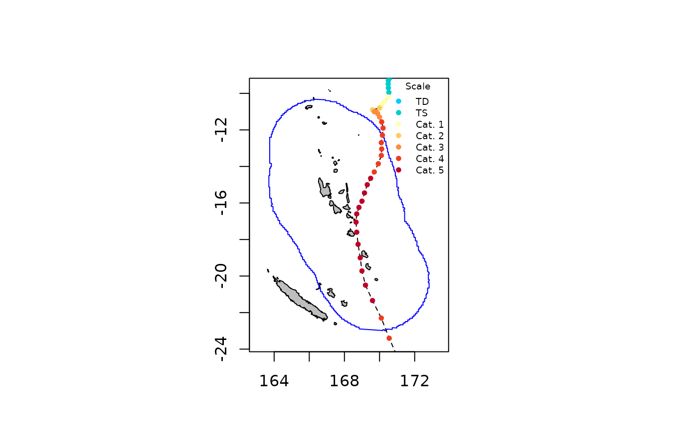
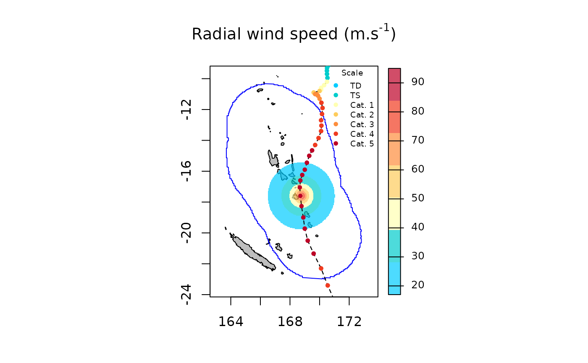
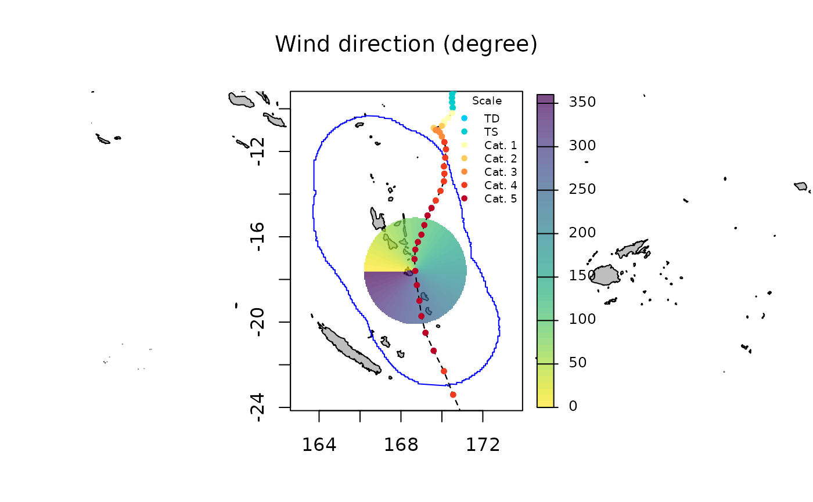
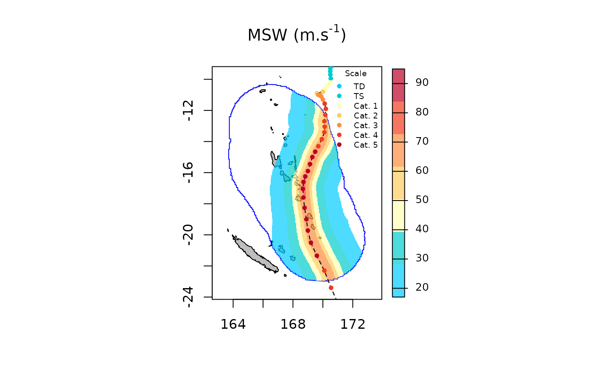
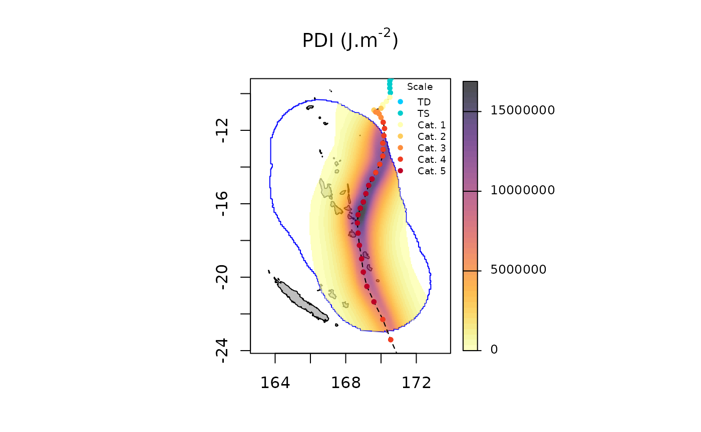
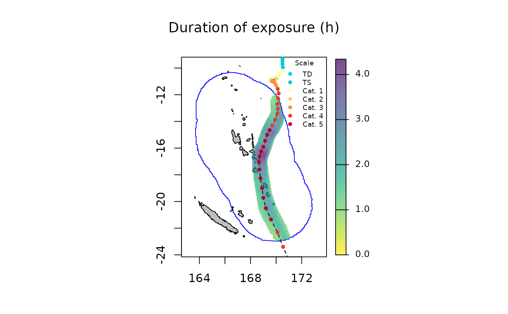
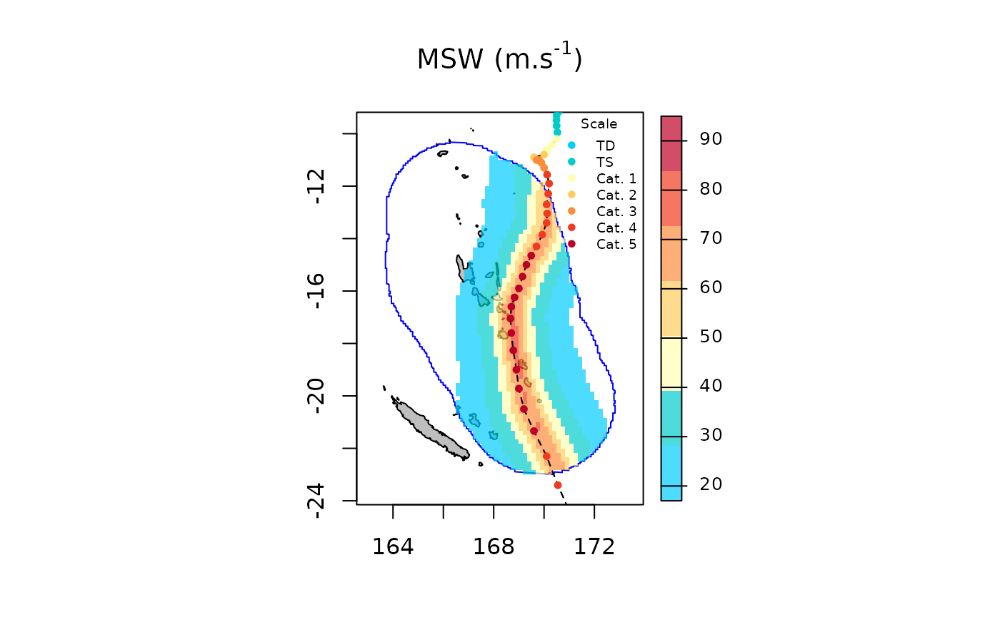

# spatialBehaviour

The [`spatialBehaviour()`](../reference/spatialBehaviour.md) function
allows computing wind speed and direction for each cell of a regular
grid (i.e., a raster) for a given tropical cyclone or set of tropical
cyclones. The `product="Profiles"` argument allows producing 2D wind
fields during the lifespan of the cyclone at a temporal resolution of up
to 15 minutes. The
[`spatialBehaviour()`](../reference/spatialBehaviour.md) function also
allows to compute three associated summary statistics: the maximum
sustained wind speed (`product="MSW"`), the power dissipation index
(`product="PDI"`) and the duration of exposure to winds reaching defined
speed thresholds along the life span of the cyclones
(`product="Exposure"`). Then the
[`plotBehaviour()`](../reference/plotBehaviour.md) and the
[`writeRast()`](../reference/writeRast.md) functions can be used to
visualise and export the output. In the following example we use the
`test_dataset` provided with the package to illustrate how cyclone track
data can be used to compute, plot, and export 2D wind field profiles or
summary statistics.

### Computing and plotting spatialBehaviour products

We can compute the behaviour of winds generated by the topical cyclone
Pam (2015) near Vanuatu. First, track data are extracted as follows:

``` r
sds <- defStormsDataset()
```

    ## Warning: No basin argument specified. StormR will work as expected
    ##              but cannot use basin filtering for speed-up when collecting data

    ## === Loading data  ===
    ## Open database... /home/runner/work/_temp/Library/StormR/extdata/test_dataset.nc opened
    ## Collecting data ...
    ## === DONE ===

``` r
st <- defStormsList(sds = sds, loi = "Vanuatu", names = "PAM", verbose = 0)
plotStorms(st)
```



#### Wind profiles

Using track data and the
[`spatialBehaviour()`](../reference/spatialBehaviour.md) function with
the `product="Profiles` argument we can generate 2D wind fields at any
time as follows:

``` r
pf <- spatialBehaviour(st, product = "Profiles", verbose = 0)
pf
```

    ## class       : SpatRaster 
    ## size        : 304, 219, 114  (nrow, ncol, nlyr)
    ## resolution  : 0.04166667, 0.04166667  (x, y)
    ## extent      : 163.7083, 172.8333, -23, -10.33333  (xmin, xmax, ymin, ymax)
    ## coord. ref. : lon/lat WGS 84 (CRS84) (OGC:CRS84) 
    ## source(s)   : memory
    ## names       : PAM_Speed_28, PAM_S~28.33, PAM_S~28.67, PAM_Speed_29, PAM_S~29.33, PAM_S~29.67, ... 
    ## min values  :        5.927,       2.302,       3.807,        3.087,       0.848,       2.971, ... 
    ## max values  :       61.110,      63.420,      64.483,       63.610,      64.753,      65.017, ... 
    ## time        : 2015-03-11 21:00:00 to 2015-03-14 05:00:00 UTC (57 steps)

The function returns a `SpatRaster` object with two rasters, one for the
wind speed and one for the wind direction, for each observation or
interpolated observation. Rasters’ names follow the following
terminology, the name of the storm in capital letters, “Speed” or
“Direction”, and the index of the observation, separated by underscores.
Note that actual observations have entire indices (e.g., 41, 42, …)
while interpolated observation have decimals (e.g., 41.1, 41.2, …). Most
tropical cyclone track data sets are based on observations gathered
every 3 or 6 hours. Therefore, to be able to compute wind fields every 1
hour, the observations are interpolated.

Wind speed and direction profiles at the 41^(th) observation can be
plotted as follows:

``` r
plotBehaviour(st, pf$PAM_Speed_41)
```



``` r
plotBehaviour(st, pf$PAM_Direction_41)
```



#### Summary statisics

The [`spatialBehaviour()`](../reference/spatialBehaviour.md) function
can compute the different `products` (i.e., `"Profiles"`, `"MSW"`,
`"PDI"`, `"Exposure"`) either separately or together. Here, we compute
all three summary statistics together as follows:

``` r
ss <- spatialBehaviour(st, product = c("MSW", "PDI", "Exposure"), verbose = 0)
ss
```

    ## class       : SpatRaster 
    ## size        : 304, 219, 8  (nrow, ncol, nlyr)
    ## resolution  : 0.04166667, 0.04166667  (x, y)
    ## extent      : 163.7083, 172.8333, -23, -10.33333  (xmin, xmax, ymin, ymax)
    ## coord. ref. : lon/lat WGS 84 (CRS84) (OGC:CRS84) 
    ## source(s)   : memory
    ## names       :  PAM_MSW,     PAM_PDI, PAM_E~re_18, PAM_E~re_33, PAM_E~re_42, PAM_E~re_49, ... 
    ## min values  : 13.78700,    18868.69,     1.00000,     1.00000,    1.000000,    1.000000, ... 
    ## max values  : 73.90446, 16893412.03,    30.90083,    14.70248,    9.446281,    6.826446, ... 
    ## time        : 2015-03-11 15:00:00 UTC

The [`spatialBehaviour()`](../reference/spatialBehaviour.md) function
returns a `SpatRaster` object with eight rasters: one for the maximum
sustained wind speed (`"MSW"`), one for the power dissipation index
(`"PDI"`), and one for each of the six defaults wind thresholds values
set for the duration of exposure (`"Exposure"`).

``` r
names(ss)
```

    ## [1] "PAM_MSW"         "PAM_PDI"         "PAM_Exposure_18" "PAM_Exposure_33"
    ## [5] "PAM_Exposure_42" "PAM_Exposure_49" "PAM_Exposure_58" "PAM_Exposure_70"

By default, the function returns the duration of exposure (in hours) to
wind speeds above the thresholds used by the Saffir-Simpson hurricane
wind scale (i.e., 18, 33, 42, 49, 58, and 70 $m.s^{- 1}$). This can be
change using the `wind_threshold` argument.

The maximum sustained wind speed can be plotted as follows:

``` r
plotBehaviour(st, ss$PAM_MSW)
```



The power dissipation index can be plotted as follows:

``` r
plotBehaviour(st, ss$PAM_PDI)
```



The duration of exposure to wind stronger than 58 $m.s^{- 1}$ (i.e.,
Saffir-Simpson’s categories 4 and 5) can be plotted as follows:

``` r
plotBehaviour(st, ss$PAM_Exposure_58)
```



### Spatio-temporal resolution

As in the WorldClim database
(<https://worldclim.org/data/worldclim21.html>) four spatial resolutions
are available. By default the spatial resolution is set to 2.5 min (~4.5
km at the equator), but a finer spatial resolution of 30 s (~1 km at the
equator) and coarser spatial resolutions of 5 min (~9 km at the equator)
or 10 min (~18.6 km at the equator) can be set using the `spaceRes`
argument. The temporal resolution is set to 1 hour by default but finer
spatial resolution of 0.75, 0.50, or 0.25 hour can be set using the
`tempRes` argument. Maximum sustained wind speed can be computed at a 10
min spatial resolution and a 30 min temporal resolution as follows:

``` r
ss <- spatialBehaviour(st, product = c("MSW"), verbose = 0, spaceRes = "10min", tempRes = 30)
plotBehaviour(st, ss$PAM_MSW)
```

 \####
Dynamic plot `plotBehaviour` function also provide (See ExtractStorms
vignette) a dynamic plot. Here is an example based on the same
parameters as above.

``` r
plotBehaviour(st, ss$PAM_MSW, dynamicPlot = TRUE)
```

### Exporting spatialBehaviour products

The [`spatialBehaviour()`](../reference/spatialBehaviour.md) function
returns rasters stored in a `SpatRaster` object than can be exported
either in “.tiff” or “.nc” (NetCDF) formats using the
[`writeRast()`](../reference/writeRast.md) function. Here, we export the
maximum sustained wind speed in the working directory as follows:

``` r
writeRast(ss$PAM_MSW)
```
