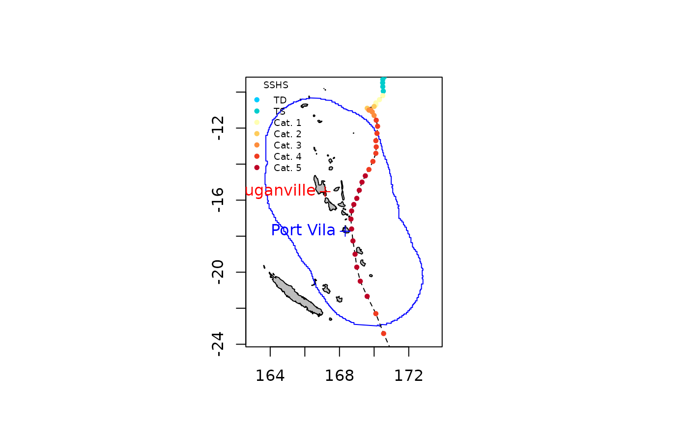
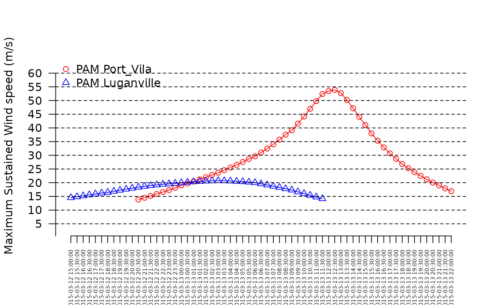
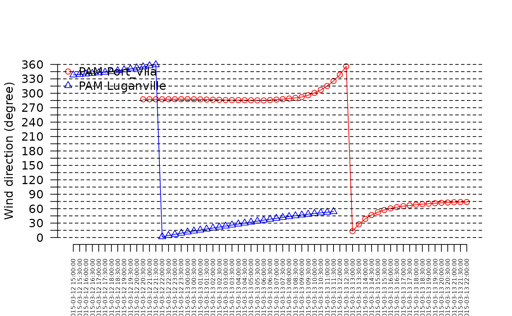

# temporalBehaviour

The [`temporalBehaviour()`](../reference/temporalBehaviour.md) function
allows computing wind speed and direction for a given location or set of
locations along the lifespan of a tropical cyclone. It also allows to
compute to compute three associated summary statistics: the maximum
sustained wind speed (`product="MSW"`), the power dissipation index
(`product="PDI"`) and the duration of exposure to winds reaching defined
speed thresholds along the life span of the cyclones
(`product="Exposure"`).

In the following example we use the `test_dataset` provided with the
package to illustrate how cyclone track data can be used to compute and
plot time series of wind speed and direction and how to compute summary
statistics for specific locations, as described below.

### Computing and plotting time series of wind speed and direction

We compute and plot time series of the speed and direction of winds
generated by the topical cyclone Pam (2015) in two of the main cities of
Vanuatu, Port Vila (longitude = 168.33, latitude = -17.73) and
Luganville (longitude = 167.17, latitude = -15.53). The coordinates of
the two locations of interest are provided in a data frame as follows:

``` r
df <- data.frame(x = c(168.33, 167.17), y = c(-17.73, -15.53))
rownames(df) <- c("Port_Vila", "Luganville")
```

The track data for Pam nearby Vanuatu are extracted as follows:

``` r
sds <- defStormsDataset()
```

    ## Warning: No basin argument specified. StormR will work as expected
    ##              but cannot use basin filtering for speed-up when collecting data

    ## === Loading data  ===
    ## Open database... /home/runner/work/_temp/Library/StormR/extdata/test_dataset.nc opened
    ## Collecting data ...
    ## === DONE ===

``` r
st <- defStormsList(sds = sds, loi = "Vanuatu", names = "PAM", verbose = 0)
plotStorms(st)
points(df$x, df$y, pch = 3, col = c("blue", "red"))
text(df$x, df$y, labels = c("Port Vila", "Luganville"), pos = 2, col = c("blue", "red"), cex = 0.8)
```



Then the [`temporalBehaviour()`](../reference/temporalBehaviour.md)
function with the `product = "TS"` argument is used to compute time
series. By default the temporal resolution of is set to 1 hour but can
be changed using the `tempRes` argument. Here we set the temporal
resolution to 30 min with `tempRes=0.5` as follows:

``` r
TS <- temporalBehaviour(st, points = df, product = "TS", tempRes = 30, verbose = 0)
```

With the above specification the
[`temporalBehaviour()`](../reference/temporalBehaviour.md) function
returns a list of two data frames (i.e., one for each location) with the
wind speed (“speed”), direction (“direction”), indices of the
observations and the date and time of the observation (“isoTimes”).

``` r
str(TS)
```

    ## List of 1
    ##  $ PAM:List of 2
    ##   ..$ Port_Vila :'data.frame':   115 obs. of  4 variables:
    ##   .. ..$ speed    : num [1:115] NA NA NA NA NA NA NA NA NA NA ...
    ##   .. ..$ direction: num [1:115] NA NA NA NA NA NA NA NA NA NA ...
    ##   .. ..$ indices  : chr [1:115] "28" "28.17" "28.33" "28.50" ...
    ##   .. ..$ isoTimes : chr [1:115] "2015-03-11 21:00:00" "2015-03-11 21:30:00" "2015-03-11 22:00:00" "2015-03-11 22:30:00" ...
    ##   ..$ Luganville:'data.frame':   115 obs. of  4 variables:
    ##   .. ..$ speed    : num [1:115] NA NA NA NA NA NA NA NA NA NA ...
    ##   .. ..$ direction: num [1:115] NA NA NA NA NA NA NA NA NA NA ...
    ##   .. ..$ indices  : chr [1:115] "28" "28.17" "28.33" "28.50" ...
    ##   .. ..$ isoTimes : chr [1:115] "2015-03-11 21:00:00" "2015-03-11 21:30:00" "2015-03-11 22:00:00" "2015-03-11 22:30:00" ...

We use the data frame and the
[`plotTemporal()`](../reference/plotTemporal.md) function to draw time
series plots for wind speed and wind direction as follows:

``` r
plotTemporal(data=TS, storm="PAM")
```



``` r
plotTemporal(data=TS, storm="PAM", var='direction')
```



Maximum sustained wind speed for Port Vila and Luganville can be
computed as follows:

``` r
max(TS$PAM$Port_Vila$speed, na.rm = TRUE)
```

    ## [1] 53.312

``` r
max(TS$PAM$Luganville$speed, na.rm = TRUE)
```

    ## [1] 22.112

### Getting power dissipation index

The power dissipation index is computed using the `product = "PDI"`
argument as follows:

``` r
PDI <- temporalBehaviour(st, points = df, product = "PDI", tempRes = 30, verbose = 0)
PDI
```

    ## $PAM
    ##     Port_Vila Luganville
    ## PDI   7566313    1206699

### Getting duration of exposure

The duration of exposure is computed using the `product = "Exposure"`
argument as follows:

``` r
exposure_SS <- temporalBehaviour(st, points = df, product = "Exposure", tempRes = 30, verbose = 0)
exposure_SS
```

    ## $PAM
    ##                       Port_Vila Luganville
    ## Min threshold: 18 m/s      23.0         16
    ## Min threshold: 33 m/s       9.5          0
    ## Min threshold: 42 m/s       5.0          0
    ## Min threshold: 49 m/s       2.0          0
    ## Min threshold: 58 m/s       0.0          0
    ## Min threshold: 70 m/s       0.0          0

By default, the function returns the duration of exposure (in hours) to
wind speeds above the thresholds used by the Saffir-Simpson hurricane
wind scale (i.e., 18, 33, 42, 49, 58, and 70 $m.s^{- 1}$). However,
different thresholds can be set using the `wind_threshold` arguments. We
can use the thresholds used by the Australian Bureau of Meteorology to
rank tropical cyclones intensity as follow:

``` r
wt <- c(17.2, 24.4, 32.5, 44.2, 55.0)
exposure_BOM <- temporalBehaviour(st, points = df, product = "Exposure", tempRes = 30, windThreshold = wt, verbose = 0)
exposure_BOM
```

    ## $PAM
    ##                         Port_Vila Luganville
    ## Min threshold: 17.2 m/s        24       17.5
    ## Min threshold: 24.4 m/s        16        0.0
    ## Min threshold: 32.5 m/s        10        0.0
    ## Min threshold: 44.2 m/s         4        0.0
    ## Min threshold: 55 m/s           0        0.0
