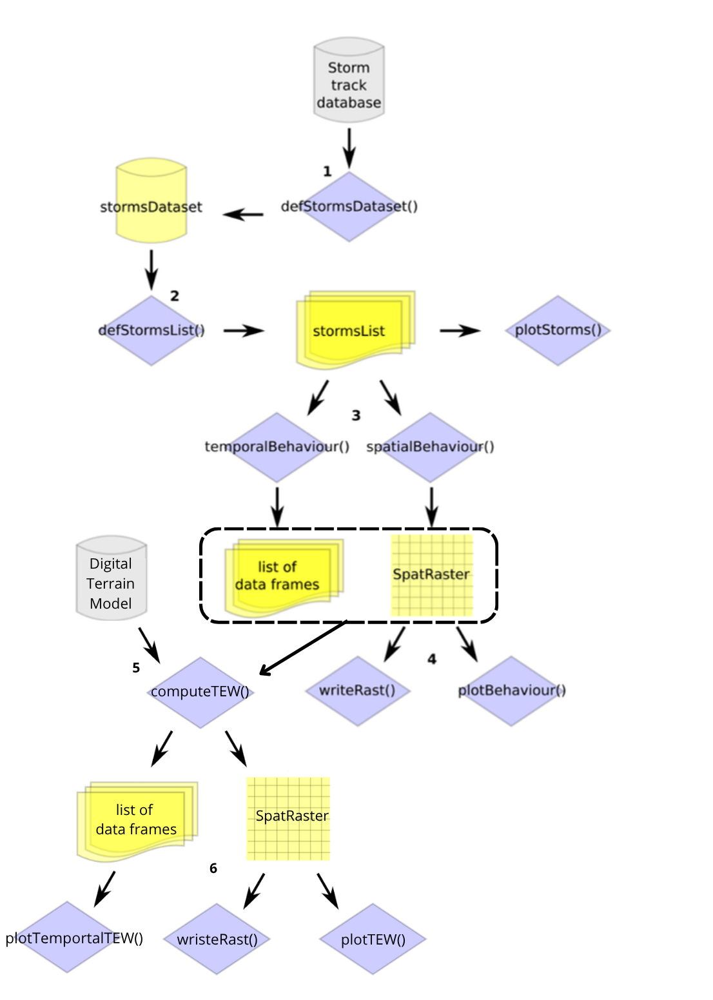

# StormR R package

## Overview

`StormR` is an R package allowing to easily extract storm track data for
given locations or areas of interests, to generate wind speed and
direction fields, and to compute summary statistics characterising the
behaviour of winds generated by tropical storms and cyclones: maximum
sustained wind speed, power dissipation index, and duration of exposure
to winds reaching defined speed thresholds.

## Usage

### Installing StormR

`StormR` is [available on
CRAN](https://cran.r-project.org/package=StormR). You can install it as
follows:

``` r

install.packages("StormR")
```

The latest development version can be installed from GitHub as follows,

``` r

#install.packages("devtools")
devtools::install_github("umr-amap/StormR")
```

Alternatively, you can install `StormR` using `conda` / `mamba`. Check
[here](https://github.com/conda-forge/r-stormr-feedstock) for more info.

``` bash
conda config --add channels conda-forge      # make sure you add conda-forge to your channel list
conda config --set channel_priority strict
conda install r-stormr    # or mamba install r-stormr
```

### Loading StormR package

``` r

library(StormR)
```

## Main functions

| **Name** | **Description** | **Inputs** | **Outputs** |
|:--:|:--:|:--:|:--:|
| [`defStormsDataset()`](reference/defStormsDataset.md) | Creates a `stormsDataset` object (1) | “.nc” (NetCDF) file | `stormsDataset` object |
| [`defStormsList()`](reference/defStormsList.md) | Extracts storms (2) | `stormsDataset` object | `stormsList` object |
| [`plotStorms()`](reference/plotStorms.md) | Plots storms track data | `stormsList` object |  |
| [`temporalBehaviour()`](reference/temporalBehaviour.md) | Computes wind speed, direction time series, and summary statistics for a given set of point coordinates (3) | `stormsList` object | list of `data.frame` objects |
| [`spatialBehaviour()`](reference/spatialBehaviour.md) | Computes 2D wind fields and summary statistics over a given location of interest (3) | `stormsList` object | `SpatRaster` object |
| [`plotBehaviour()`](reference/plotBehaviour.md) | Plots 2D wind fields and summary statistics (4) | `stormsList` + `SpatRaster` objects |  |
| [`plotTemporal()`](reference/plotTemporal.md) | Computes wind speed, direction time series, and summary statistics for a given set of point coordinates | `stormsList` & `data.frame` objects |  |
| [`computeTEW()`](reference/computeTEW.md) | Computes Topographic Exposure to Wind (TEW) for a given set of storms and a given location of interest (5) | `stormsList` + “Digital Terrain Model” + `SpatRaster` or `data.frame` objects | `SpatRaster` object |
| [`plotTEW()`](reference/plotTEW.md) | Plots TEW fields (6) | `stormsList` + `SpatRaster` |  |
| [`plotTemporalTEW()`](reference/plotTemporalTEW.md) | Plots TEW time series for a given set of point coordinates (6) | `data.frame` coordinates + list of `data.frame` TEW |  |
| [`writeRast()`](reference/writeRast.md) | Exports wind fields, TEW and summary statistics to file (4, 6) | `SpatRaster` object | `.tiff` or `.nc` file |

## Workflow



*Simplified workflow and main functions of the StormR R package.
External storm track database and Digital Terrain Model in grey, main
functions in blue, and R objects created by the stormR functions in
yellow. The numbers (1 to 6) indicate the suggested step-by-step
workflow.*

## Contributing

You are welcome to contribute to the `StormR` package. Just fork the
project and create a pull request with your changes and we will review
it as soon as possible.

## Reporting issues

Issues can be reported
[here](https://github.com/umr-amap/StormR/issues/new/choose). Simply
choose the appropriate template and fill in the requested information.

## Seeking help

If you need help with the `StormR` package, please open a new discussion
on the [Q&A section on
github](https://github.com/umr-amap/StormR/discussions/categories/q-a).
We will do our best to answer your questions. Other users are also
welcome to help you.

## Funding

This work was supported by Hermon Slade Foundation, [grant HSF
19105](http://www.hermonslade.org.au/hsf19105/).
